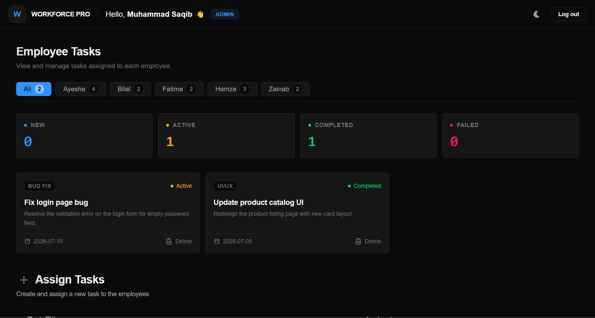

<h1 align="center">Hi, I'm Saqib Hussnain 👋</h1>

  React Developer & BSCS Student &nbsp;|&nbsp; Building real, deployed projects &nbsp;|&nbsp; Path: Full-Stack → Data Science & AI

  
  
  

---

### 👨‍💻 About Me

- 🎓 BSCS student at University of the Punjab 
- 💻 React Developer building real, deployed projects
- 🏅 Google AI Professional Certificate holder
- 🔭 Next goal: Next.js and Python backend development, then Data Science & AI
- 🌱 Interned at CodeAlpha as a Frontend Development Intern (June 2026)

---

### 🛠️ Tech Stack

  
  
  
  
  
  
  
  
  
  
  

---

---

### ⭐ Featured Project

  ### 👔 Workforce Pro - Employee Management System

  

  **A role-based task management platform** where admins assign work and employees track it through its full lifecycle — built solo after a tutorial-based first pass, then completely rebuilt with 85+ commits over 20+ days.

  🔹 Separate Admin & Employee dashboards with protected routing
  🔹 Full task lifecycle: New → Active → Completed / Failed, synced in real time across both dashboards
  🔹 Dark/Light mode via a custom `useTheme` hook
  🔹 Vercel-inspired UI built with Tailwind CSS v4 design tokens

  

    
    
    
  

  [**Live Demo**](https://workforce-pro-elite.vercel.app) &nbsp;|&nbsp; [**Source Code**](https://github.com/Saqib216/employee-management-system)

---

### 🚀 Projects

| Project | Description | Tech | Live |
|---|---|---|---|
| 👔 Workforce Pro (EMS) | Role-based Employee Management System - Admin/Employee dashboards, full task lifecycle (New→Active→Completed/Failed), dark/light mode, protected routing | React, Tailwind CSS v4, Context API, React Router | [Live](https://workforce-pro-elite.vercel.app) |
| 🤖 AI Text Toolkit | 6-mode AI text processor using Gemini API | HTML, CSS, JS, Gemini API | [Live](https://ai-text-toolkit-opal.vercel.app) |
| 🎵 Spotify Clone | Fully functional music player with JSON-based playlists | HTML, CSS, JS | [Live](https://soundpulse-nine.vercel.app/) |
| 💱 Currency Converter | Real-time converter for 150+ currencies with live API | HTML, CSS, JS | [Live](https://currency-converter-sleek.vercel.app/) |
| 🧮 Calculator App | Feature-rich calculator with keyboard support, expression history & advanced operations (√, x², %) | HTML, CSS, JS | [Live](https://calculator-neon-beta.vercel.app/) |
| 🎧 PULSE Music Player | Glassmorphism music player with animated seek bar, volume control & mobile slide-up overlay | HTML, CSS, JS | [Live](https://music-player-pulse.vercel.app) |
| 🖼️ LUMINA Image Gallery | Responsive image gallery with category filters, live search & keyboard-navigable lightbox | HTML, CSS, JS | [Live](https://image-gallery-lumina.vercel.app) |

---

### 📚 Currently Learning
- ⚡ Next.js — actively learning now
- 🐍 Python (backend) — next in line for Data Science path

### ✅ Recently Completed
- ⚛️ React.js (advanced: Context API, protected routing, custom hooks)
- 🎨 Tailwind CSS v4

### 🏅 Certifications
- Google AI Professional Certificate (7 courses + capstone)
---

### 📊 GitHub Stats

  

---

  <i>Not just learning to code. Building things that actually work.</i>

